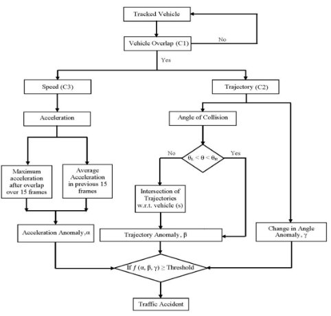
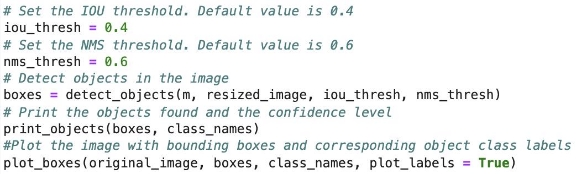
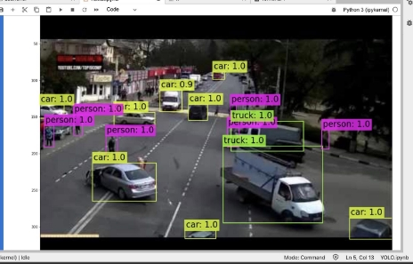
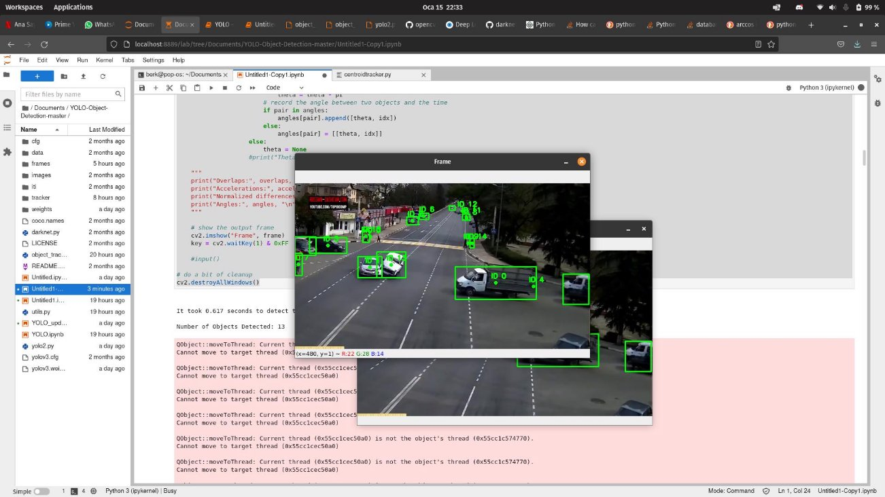
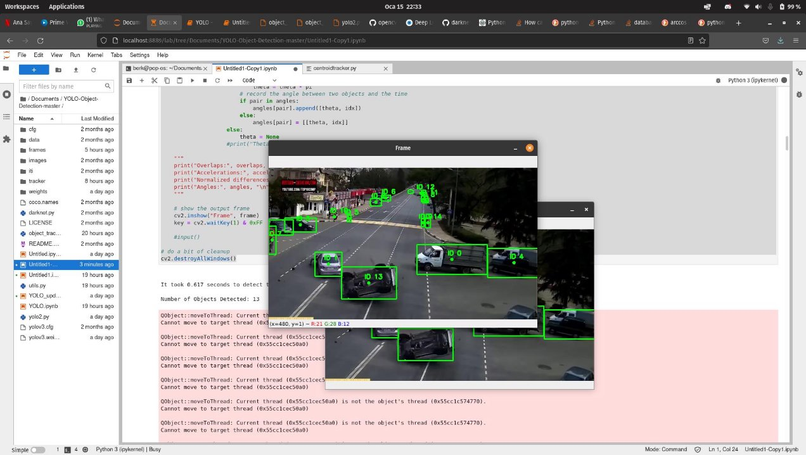
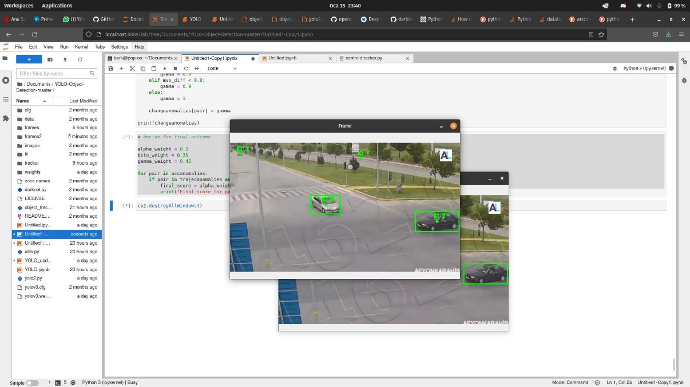
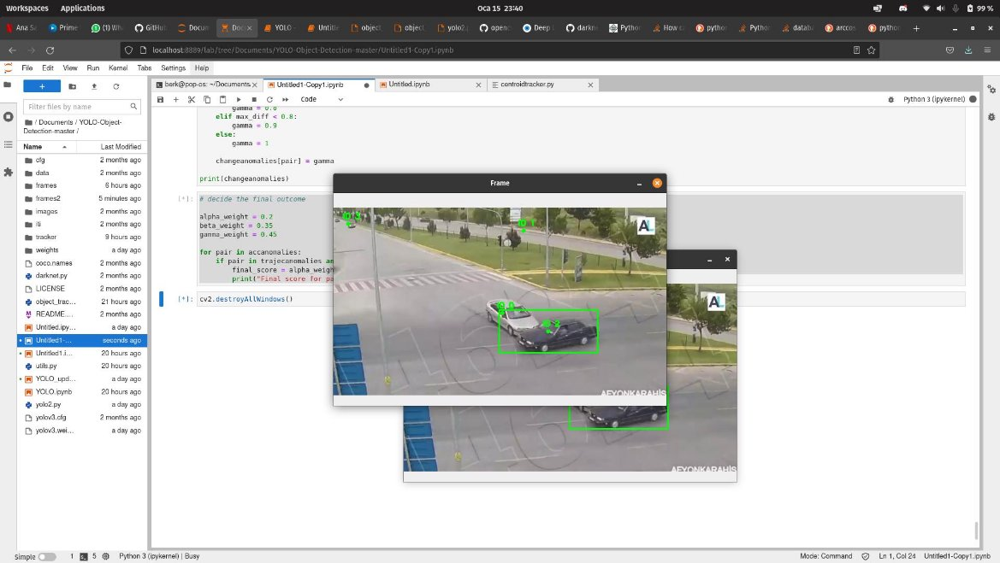
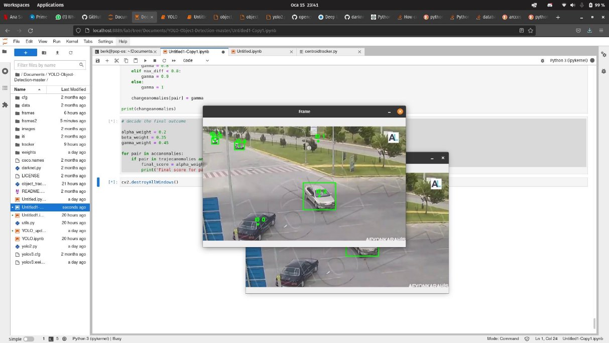

# Accident Detection in Traffic**

**Berk Açıkgöz – 26631 Yusufhan Kırçova – 26678**

## Problem Definition and Objective**

Each year, 1.35 million people are killed on roadways, and every day almost 3,700 people are killed globally in motor vehicle crashes (WHO,2021). It is estimated to be the 8th leading cause of death globally and leading cause of death for children and young adults 5-29 years of age. It is estimated that crash injuries cost the world approximately 1.8 trillion dollars. Statistics show that low- and middle-income countries are more affected by motor vehicle crashes. Crash death rates are over three times higher in low-income countries. While possessing %60 of the world’s registered vehicles, low-income countries are responsible for the %90 of the world’s motor vehicle deaths.

Project objective is to develop a software, which can detect motor vehicle crashes as soon as it occurs, depending on parameters such as vehicle speed and vehicle direction. Furthermore, a system in which the emergency contacts of the drivers and local emergency services are notified of the crash, can be used to provide help to the injured people. This project is related to Feature detection, Object Recognition, Visual Tracking Motion Estimation and Anomaly Detection. A system in which can

Next steps for our project would be to predict the car crashes beforehand using live footage and warning the drivers. Therefore, the system might prevent accidents before they occur.

## Problem Formulation and Solution Method

Given a video input, in order to detect accidents in traffic we must utilize Object detection, Object tracking to gather vehicle movement data. Using the data gathered from the input, unordinary movement will be analyzed using speed, acceleration anomaly, change in angle anomaly and vehicle overlap. Our analysis will provide an integer which will show if an accident occurs or not in the given footage.

The accident detection algorithm proposed by Ijjina et al (2019) consists of two main parts:

- Vehicle Detection and Vehicle Tracking
- Accident Detection
### 1. Vehicle Detection and Vehicle Tracking**

First part of the project was to detect the vehicles in a given image using object detection frameworks. This was necessary since the project requires objects to be tracked in order to gather vehicle movement data. YOLOv3 (You Only Look Once, Version 3) is a real-time object detection algorithm that identifies specific objects in videos, live feeds, or images (Redmon et al, 2016). YOLOv3 was used to detect vehicles in a given image. Centroid tracking was utilized to achieve object tracking, so that moving objects can be identified and movement data such as speed, acceleration and movement trajectory can be extracted (Nascimento et al, 1999).

### 2. Accident Detection

We implemented an accident detection algorithm which was used to detect car crashes using anomalies in vehicle movement. This algorithm and along with some threshold information have been published by IEEE and have been used in our project.

fig. 1. Workflow of the algorithm

First condition for an algorithm to consider a possibility of crash is the position of each vehicle. For a vehicle to be crashed with another, their respective positions must overlap. This condition is checked using the positions we have found with Object Tracking. The equation for this condition is given below. If the condition below holds up then this will indicate that an overlap occurs.

(2×|a.x−b.x| < a.α+b.α) ∧ (2×|a.y-b.y| < a.β+b.β)

Second part of the tree divides into two sub-parts, with each part calculating a different measure for the probability of an accident.

**C2) Trajectory**

In order to determine the trajectories of the vehicles we use the centroids of vehicles for a time interval. Taking the differences between five successive centroids will give us a vector in which the trajectories of the vehicle will be inclined to move.

We are required to determine the angle between different trajectories by using the angle between two vector formulas which can be seen below.

**C3) Speed**

In order to determine the speed of the vehicles we estimate τ, the interval between the frames of the video, using the Frames Per Second (FPS).

During our implementation we used a constant FPS of 60 Frames per second. The distance covered by each vehicle is found by getting the centroids of vehicles over five frames. Gross Speed (Sg)is determined by the centroid difference (c1,c2) over five frames of time. The interval is the parameter which is determined by the number of frames which are taken into consideration while calculating the centroids, in this case we have fixed it to five frames, since it gave us more accurate results.

Then gross speed is normalized by the irrespective of its distance from the camera. Normalization was calculated by taking video frame (H), height of bounding box (h), width of the video frame(W), width of the bounding box and Gross Speed (Sg). Scaled Speeds are calculated by normalizing the gross speed.

Since we will be taking into consideration both acceleration and speed, we must calculate the Acceleration of the vehicle for a given interval. Since, acceleration is the difference in speed between an interval of time such calculation can be made by the following formula below.

Using all of the variables which have been collected by different operations we are going to calculate the probability of an accident. Acceleration Anomaly, Trajectory Anomaly and Change in Angle Anomaly are all taken into consideration while calculating the final value. The combination of all the parameters are used in a function which takes into weightages of each individual threshold. At last if the final value is greater than 0.5 then it is considered as a vehicular accident.

## Implementation and Results

Jupyter-notebook was used during the implementation since it helped us to run python scripts part by part without having to go over the whole code block.

For the first step of the implementation, we developed a structure in which a particular mp4 file is divided into frame images which can be used in later stages of the code. Since we were frequently testing if the outputs are correct or not, this part was essential to the project and prioritized among other parts.

OpenCV was utilized and a while loop is used to go over each frame of the image. **Object Detection**

We applied the YOLOv3 Algorithm to detect objects in given frames (Redmon et al, 2016) (Garima13a, 2018). We have used opencv to load images, and a modified version of darknet which is a deep neural network written by the creators of YOLO Algorithm. This specific version of the darknet was modified in order to work with PyTorch. However, since we are not going to be doing any neural network training, we are going to use a pre-trained set of weights which were initially trained on Common Objects in Context. The weights can be found under the Issues tab in the referred GitHub project, please see References. Since the CPU was being utilized by Darknet each individual image took around 5-10 seconds to complete its detection. We set nms threshold to 0.6 and iou threshold to 0.4.

YOLOv3 provides results with high accuracy and high confidence. Most of the images we tested had almost perfect results. Since we were only looking at cars, trucks and busses; YOLOv3 was more than enough for our project. The detected objects were held in a box array which will be used throughout the implementation of other steps. Below images are some examples of object detection using YOLOv3

Figure 2: Object Detection using YOLOv3

Figure 3: Object Detection using YOLOv3

### Object Tracking

The centroid tracking algorithm was used to track the objects detected with YOLO v3 (Nascimento et al, 1999). The algorithm works on the simple principle that a centroid (center of the rectangle of the detected object) in one frame must be closest to the centroid that belongs to the same object in the next frame, even if the object moves. An implementation of centroid tracking was utilized alongside YOLO v3 to track the moving vehicles (Rosebrock, 2018). Some snapshots that display the tracked objects can be found below.

Fig. 4.1: The state of tracked objects just before an accident.

Figure 4.2: The tracked objects at the moment of the accident

Figure 4.3: The tracked objects at the after the accident

### Accident Detection

The angle and acceleration at given moments were calculated as per explained in the Problem Formulation and Solution Method section. The three parameters; Acceleration Anomaly (α), Trajectory Anomaly (β) and Change in Angle Anomaly (ɣ) were calculated in light of the methodology explained in (Ijjina et al., 2019).

For the acceleration anomaly, the difference between the maximum acceleration in the 15 frames following the collision and the average acceleration in the 15 frames preceding the accident was calculated. The maximum value for any given object pair for the entire video was taken as premises to decide on the value of alpha. For the mapping function, please refer to the Appendix, under the “acceleration anomaly detection” section.

For the trajectory anomaly, -π/4 was selected asθ andπ/4 was selected asθ

low high and beta was chosen as either 0 or 0.1, (refer to Appendix). For the angles outside

that interval, their absolute value was taken and they were scaled withπ/2, which became the value of beta.

For the change in angle anomaly, the difference between the angles in two adjacent frames were taken. For any vehicle pair, the maximum of these angle differences were taken as premises for the value of gamma. The maximum angle difference was mapped to certain values of gamma, which increase faster as the angle increases and saturates at gamma = 1 when the value of the angle becomes 0.8 radians. For the entire mapping function, please refer to the Appendix, under the “change in angle anomaly detection” section.

Finally, these three parameters are all given weights, chosen as 0.2 for alpha, 0.35 for beta and 0.45 by gamma in our case, and if the weighted sum of these three parameters exceed 0.5, it is decided that an accident occured between the given vehicle/object pair.

## Discussion of Results

In our first trial, there were only two accidents detected: between object ID 0 and 4, and between object ID 1 and 13. However, only the accident between ID 1 and 13 actually occurred, which has a larger score than the other detected accident. The output is given below:

Final score for pair (0, 4) is  0.775180899378008 Final score for pair (1, 13) is  0.8751938894351401

The false detection for object pair (0, 4) is due to object 0 and 4 obstructing each other for the bigger part of the video. This obstruction results in very similar features to the case of an actual accident, hence the false positive. A better video angle can prevent such cases being detected as false positives.

Below are the results from a different trial:

Figure 5.1 The tracked objects at the before  the accident

Figure 5.2 The tracked objects at the time of  the accident

Figure 5.3 The tracked objects at the after  the accident The final results for the video are as follows:

Final score for pair (0, 2) is  0.6652992124147674

Final score for pair (3, 5) is  0.08

The detection between objects 0 and 2 are successfully detected, whereas the interaction between objects 3 and 5 are not deemed as an accident, as the total score is below 0.5. As no vehicle is obstructed for a long time by another, no such false positives are observed.

## Resources

Garima13a (2018). YOLO Object Detection. Retrieved from <https://github.com/Garima13a/YOLO-Object-Detection> on January 8, 2022.

Ijjina, E. P., Chand, D., Gupta, S., & Goutham, K. (2019). Computer vision-based accident detection in traffic surveillance. *2019 10th International Conference on Computing, Communication and Networking Technologies (ICCCNT)*. https://doi.org/10.1109/icccnt45670.2019.8944469

Nascimento, J. C., Abrantes, A. J., & Marques, J. S. (1999). An algorithm for centroid-based tracking of moving objects. *1999 IEEE International Conference on Acoustics, Speech, and Signal Processing. Proceedings. ICASSP99 (Cat. No.99CH36258)*. <https://doi.org/10.1109/icassp.1999.757548>

Redmon, J., Divvala, S., Girshick, R., & Farhadi, A. (2016). You only look once: Unified, real-time object detection. *2016 IEEE Conference on Computer Vision and Pattern Recognition (CVPR)*. https://doi.org/10.1109/cvpr.2016.91

Redmon Joseph (2013–2016). Darknet: Open Source Neural Networks in C <http://pjreddie.com/darknet/>

Redmon Joseph (2018). An Incremental Improvement <https://pjreddie.com/darknet/yolo/>

Rosebrock, A. (2018). Simple object tracking with OpenCV. Retrieved from [https://www.pyimagesearch.com/2018/07/23/simple-object-tracking-with-opencv/ ](https://www.pyimagesearch.com/2018/07/23/simple-object-tracking-with-opencv/)on December 30, 2021.

World Health Organization. (2021). *Road traffic injuries*. World Health Organization. Retrieved January 15, 2022, from https://www.who.int/news-room/fact-sheets/detail/road-traffic-injuries
